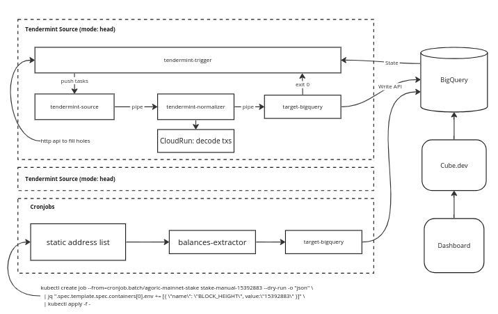
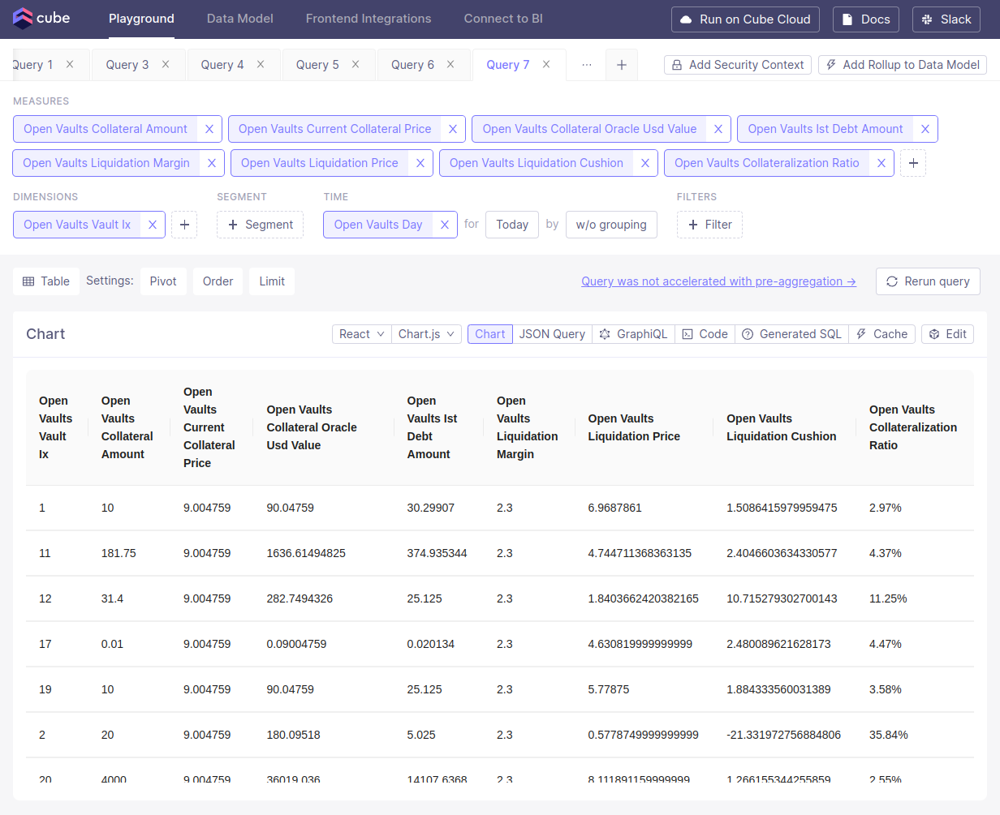

# Agoric Indexer and Dashboard

This project provides a comprehensive tool for extracting and visualizing Agoric Network data. It extracts per-block data from Tendermint and other relevant sources, loads it in data warehaouse (Google BigQuery by default), provides a semantic layout and a REST API for loaded data and then builds a visualization dashboard on top of this API.

Semantic layout and visualiation dashboard refer to Inter Protocol smart contract in Agoric blockchain. Indexed block data refers to all data in the network.

Technologies used for this solution are following:

* Block indexer – a custom set of extractors from Tendermint-compatible networks with defined relational schema for extracted data. Golang-based.
* Semantic layout and REST API – cube.js as data transformation layaer
* Data warehouse – Google BigQuery
* Visualisation Dashboard – React application based on Shadcn UI kit

# Repository layout

This repository consists of following directories:

* `cube` – Cube.js model definitions. Is built into a separate Docker image.
* `dashboard` – React visualisation dashboard. Is built into a separate Docker image.
* `docs` – Documentation directory
* `http-processor` – HTTP service for decoding trasnactions and calling txdecode command of Agoric node binary. Is a part of a indexating Docker image.
* `patches` – Ad-hoc patches for z3-target-bigquery library and Agoric binary, which are implemented on docker compose start. Is a part of a indexating Docker image.
* `tendermint-trigger` – Golang program, which ensures data integrity across gathered data. Is a part of a indexating Docker image.
* `tendermint-source` – Golang program, which fetches block sources from  RPC node. Is a part of a indexating Docker image.
* `balances-extractor` – Python script, which fetches balances data from the gRPC node. Is a part of a indexating Docker image.
* `tendermint-normalizer` – Python script, which decomposes Tendermint RPC responce into blocks, transactions, events, etc. Is a part of a indexating Docker image. 


# Architecture



The solution consists of the folling parts:

* Extractor
* Cube.dev data transformation platform
* Data warehouse (currently a Google BigQuery instance)
* React analytics dashboard

Tendermint extractor extract data from RPC nodes, normalizes it and stores in BigQuery. Then analytical metrics are calculated by Cube.dev and passed to dashboard for users. Cube.dev also serves as cahcing layer to prevent BigQuery resourcers overspending. Each of these building blocks is run as a Docker container and can be deployed in any Docker-supported environment both as a set of independent containers or as a part of archistration system (i.e. Kubernetes).

## Subsystems detailed description

### Extractor

Extractor is not a monilythic software and consists of the following components which can be reused as single commands and in any order, because they use a UNIX design philosophy and communicate using UNIX pipes between each other. Extractor consists of the following modules:

* `tendermint-trigger`
* `tendermint-source` is a Golang program
* `tendermint-normalizer` is a Python script for transforming raw block info in the form suitable for saving data in the database. This includes decoding the blocks' payload, decoding events from base64-encoded form, decoding transactions and extracting state_update events to a separate database table.
* `balances-extractor` is Python project which makes gRPC calls for fetching balances info for accounts corresponding Agoric channel balances (for calculating Interchain EST). The exact list of addresses can be altered in env configuration. 
* `z3-target-bigquery` is a BQ writer, which is responcible for sending data to BQ instance. It is installad as a Python package upon Docker image building. 

### Cube.js

Cube is a universal semantic layer that makes it easy to connect data silos, create consistent metrics, and make them accessible to any data experience your business or your customers needs. Data engineers and application developers use Cube’s developer-friendly platform to organize data from your cloud data warehouses into centralized, consistent definitions, and deliver it to every downstream tool via its APIs.

With Cube, we can build a data model, manage access control and caching, and expose your data to every application via REST, GraphQL, and SQL APIs. With these APIs, we can use any charting library to build custom UI, connect existing dashboarding and reporting tools, and build AI agents with frameworks like Langchain.

### Data warehouse

Extractors save all data directly to BigQuery without additional
intermediate databases.

### Analytics dashboard

The dashboard is built on React and [shadch/ui](https://ui.shadcn.com/). [Rechart.js](https://recharts.org/) is used for visualization.

# Quickstart

## Service Account

Create a service account for the indexer & cube with `Bigquery Admin`
and `Storage Admin`. Copy a json key to `bigquerycreds.json`.

## Configuration

The main configuration is passed to services as environmental variables. Example configuration can be found in `.env.example` file. To prepare configuration from an example file

```
cp .env.example .env
```

## Running docker-compose

This repository is shipped with docker compose config and can be started with the following commands:

```bash
# Build and run containers
docker-compose up --build
```

Create an extract function for reserves:
```sql
CREATE FUNCTION agoric_mainnet.extract_allocations(input STRING)
RETURNS Array<JSON>
LANGUAGE js AS """
  var res = [];
  var data = JSON.parse(input);

  Object.keys(data).forEach(k => {
    res.push({
      key: k,
      data: data[k],
    });
  });

  return res;
""";
```

You can immediately check extracted data here:

* Dashboard: http://localhost:8080
* Cube Playground: http://localhost:4000
* Tendermint trigger REST API http://localhost:3333

All other aspects of the indexation process can be analysed checking logs in docker-compose stdout.

## Extracting data

Upon the launch the indexer starts processing Agoric blocks from the head block to newer created blocks and at the same time from head block to genesis using RPC nodes listed in configuration file. This is managed by starting by running two Tendermint trigger containers at the same time. In order to leave only one extraction mode (from the current block to future or from the current block to past) one can comment corresponding block in `docker-compose.yml` configuration file or just run `docker compose` command with certain container only, e.g. `docker-compose up head-indexer` for running a single head indexer.

In order to extract a certain range of blocks one can call Extractor's HTTP interface with the following params:

```bash
curl -d '{"earliest":"xxx","latest":"xxx"}' http://localhost:3333
```

This endpoint will check the existance of given blocks in the database and will skip duplicated ones. Please note that blocks are being written into the BQ instance with some latency, normally 1-2 minutes.

## Creating Cube.dev schemas and views

In order to prepare Cube.dev models in BigQuery for serving them through API to dashboard one should manually execute all required queries by running the following set of commands:

```bash
# Wait the indexer schema

# create additional views for model
cat cube/views.sql | bq query

# Start Cube
docker-compose up cubejs

# open http://localhost:4000
```

# REST API

## Cube.dev Queries

The following queries serve as examples for the dashboard:

## State Changes

```json
{
  "order": [
    [
      "state_changes.count",
      "desc"
    ]
  ],
  "dimensions": [
    "state_changes.path_without_wallet_addresses"
  ],
  "measures": [
    "state_changes.count"
  ]
}
```

## PSM Stats

```json
{
  "order": {
    "psm_governance.last_mint_limit": "desc"
  },
  "measures": [
    "psm_governance.last_mint_limit",
    "psm_stats.last_minted_pool_balance",
    "psm_stats.last_utilization_rate"
  ],
  "dimensions": [
    "psm_stats.coin"
  ],
  "timeDimensions": [
    {
      "dimension": "psm_stats.day",
      "granularity": "day",
      "dateRange": "Today"
    }
  ]
}
```

## Reserve

```json
{
  "measures": [
    "reserve.atom_amount_avg",
    "reserve.fee_amount_avg"
  ],
  "timeDimensions": [
    {
      "dimension": "reserve.day",
      "granularity": "day",
      "dateRange": "Today"
    }
  ]
}
```

### Vault managers

```json
{
  "measures": [
    "vault_managers.total_locked_collateral",
    "vault_managers.total_locked_collateral_usd",
    "vault_managers.total_ist_minted",
    "vault_managers.colletarization_ratio",
    "vault_managers.ist_minting_limit",
    "vault_managers.utilization_rate"
  ],
  "timeDimensions": [
    {
      "dimension": "vault_managers.day",
      "granularity": "day",
      "dateRange": "Today"
    }
  ],
  "order": {
    "vault_managers.total_locked_collateral": "desc"
  },
  "dimensions": [
    "vault_managers.type"
  ]
}
```

#### Open Vaults

```json
{
  "measures": [
    "open_vaults.collateral_amount",
    "open_vaults.current_collateral_price",
    "open_vaults.collateral_oracle_usd_value",
    "open_vaults.ist_debt_amount",
    "open_vaults.liquidation_margin",
    "open_vaults.liquidation_price",
    "open_vaults.liquidation_cushion",
    "open_vaults.collateralization_ratio"
  ],
  "timeDimensions": [
    {
      "dimension": "open_vaults.day",
      "dateRange": "Today"
    }
  ],
  "dimensions": [
    "open_vaults.vault_ix"
  ],
  "order": [
    [
      "open_vaults.vault_ix",
      "asc"
    ]
  ]
}
```

### Liquidated vaults

```json
{
    "measures": [
        "liquidated_vaults.liquidating_locked_value",
        "liquidated_vaults.liquidation_token_price",
        "liquidated_vaults.current_collateral_price",
        "liquidated_vaults.liquidating_debt_amount",
        "liquidated_vaults.liquidation_margin",
        "liquidated_vaults.liquidating_start_time",
        "liquidated_vaults.liquidated_time"
    ],
    "timeDimensions": [
        {
            "dimension": "liquidated_vaults.day",
            "granularity": "day",
            "dateRange": "Today"
        }
    ],
    "order": {
        "liquidated_vaults.debt_type": "asc",
        "liquidated_vaults.vault_ix": "asc"
    },
    "dimensions": [
        "liquidated_vaults.debt_type",
        "liquidated_vaults.vault_ix",
        "liquidated_vaults.collateral_type",
        "liquidated_vaults.vault_state"
    ]
}
```

### Total Interchain IST

```json
{
  "order": {},
  "measures": [
    "ibc_balances.amount_sum"
  ],
  "timeDimensions": [
    {
      "dimension": "ibc_balances.day",
      "dateRange": "Today"
    }
  ]
}
```

### Cube Playground

You can test and make your own queries in the [Cube Playground](https://cube.dev/docs/product/workspace/playground):




### Checking Data Integrity

In order to check the integrity of extracted data one can make the following query to BigQuery instance:

```sql
with mm as (
   select min(block_height) mn, max(block_height) mx
     from `xxx.blocks`
)
select avg(events.count / b.event_count) as status_events
     , avg(msgs.count / b.message_count) as status_msgs
     , avg(txs.count / b.transaction_count) as status_txs
     , count(block_height) / count(distinct block_height) as status_blocks
     , count(block_height) / (max(block_height) - min(block_height)) as status_missing_total
     , sum(events.count) event_count
     , sum(msgs.count) msg_count
     , sum(txs.count) tx_count
     , count(block_height) as total_count
     , (max(block_height) - min(block_height)) as expected_total
     , (max(block_time) - min(block_time)) / count(block_height) avg_build_block_time
     , (max(_sdc_batched_at) - min(_sdc_batched_at)) / count(block_height) avg_extract_block_time
     , max(block_height) as last_block_height
     , max(block_height - prev_block_height) as max_hole
from (
  select block_height
       , block_time
       , event_count
       , message_count
       , transaction_count
       , _sdc_batched_at
       , lag(block_height) over (order by block_height) as prev_block_height
    from `xxx.blocks`
    where block_height between (select mn from mm) + 500 and (select mx from mm) - 500
) b
left join (
  select block_height, count(block_height) count
    from `xxx.events`
   group by 1
) events using (block_height)
left join (
  select block_height, count(block_height) count
    from `xxx.messages`
   group by 1
) msgs using (block_height)
left join (
  select block_height, count(block_height) count
    from `xxx.transactions`
   group by 1
) txs using (block_height)
```

## Manual Filling Missing Blocks

If some blocks were failed during the indexing process, then you can find them in this way. The result will be `curl` commands to manually start indexing:

```sql
with mm as (
   select min(block_height) mn, max(block_height) mx
     from `xxx.blocks`
)
select array_to_string(array_agg('curl -d \'' || to_json_string(to_json(struct(earliest, latest))) || '\' http://localhost:3333'), '\n'), count(earliest)
  from (
    select next as earliest
         , least(next + 99, block_height - 1) as latest
     from (
      select block_height
           , lag(block_height) over (order by block_height) as prev_block_height
        from `xxx.blocks`
       where block_height between (select mn from mm) + 500 and (select mx from mm) - 500
     )
     cross join unnest(generate_array(prev_block_height + 1, block_height - 1, 100)) next
     where block_height - prev_block_height > 1
     order by 1
  )
```

If the extractors are running in kubernetes, then you can forward the port to the local machine in this way:
```bash
kubectl port-forward agoric-mainnet-tendermint-head-5f876fb589-cvt5c 3333:3333
```


## Cube.dev API docs

The primary endpoint for handling requests is /cubejs-api/v1/load.
For further details, refer to the Cube documentation: [Cube Docs](https://cube.dev/docs/reference/rest-api).

Example request:

```bash
# Request with http method GET
curl \
  -G \
  --data-urlencode
  'query={"measures":["ibc_balances.amount_sum"],"timeDimensions":[{"dimension": "ibc_balances.day","dateRange": "Today"}]}' \
  http://localhost:4000/cubejs-api/v1/load

# Request with http method POST
# Use POST to fix problem with query length limits
curl \
 -X POST  \
 -H "Content-Type: application/json" \
 --data '{"query": {"measures":["ibc_balances.amount_sum"],"timeDimensions":[{"dimension": "ibc_balances.day","dateRange": "Today"}]}}' \
 http://localhost:4000/cubejs-api/v1/load
```

Example response:

```json
{
  "query": {
    "measures": [
      "ibc_balances.amount_sum"
    ],
    "timeDimensions": [
      {
        "dimension": "ibc_balances.day",
        "dateRange": [
          "2023-07-31T00:00:00.000",
          "2023-07-31T23:59:59.999"
        ]
      }
    ],
    "limit": 10000,
    "timezone": "UTC",
    "order": [],
    "filters": [],
    "dimensions": [],
    "rowLimit": 10000
  },
  "data": [
    {
      "ibc_balances.amount_sum": "793702.001897"
    }
  ],
  "lastRefreshTime": "2023-07-31T11:04:00.000Z",
  "usedPreAggregations": {
    "dev_pre_aggregations.ibc_balances_main": {
      "targetTableName": "dev_pre_aggregations.ibc_balances_main_tz3z0wdm_fkktrsu3_1icf590",
      "refreshKeyValues": [],
      "lastUpdatedAt": 1690801440000
    }
  },
  "transformedQuery": {
    "sortedDimensions": [],
    "sortedTimeDimensions": [
      [
        "ibc_balances.day",
        "day"
      ]
    ],
    "timeDimensions": [
      [
        "ibc_balances.day",
        null
      ]
    ],
    "measures": [
      "ibc_balances.amount_sum"
    ],
    "leafMeasureAdditive": true,
    "leafMeasures": [
      "ibc_balances.amount_sum"
    ],
    "measureToLeafMeasures": {
      "ibc_balances.amount_sum": [
        {
          "measure": "ibc_balances.amount_sum",
          "additive": true,
          "type": "sum"
        }
      ]
    },
    "hasNoTimeDimensionsWithoutGranularity": false,
    "allFiltersWithinSelectedDimensions": true,
    "isAdditive": true,
    "granularityHierarchies": {
      "year": ["year", "quarter", "month", "month", "day", "hour", "minute", "second"],
      "quarter": ["quarter", "month", "day", "hour", "minute", "second"],
      "month": ["month", "day", "hour", "minute", "second"],
      "week": ["week", "day", "hour", "minute", "second"],
      "day": ["day", "hour", "minute", "second"],
      "hour": ["hour", "minute", "second"],
      "minute": ["minute", "second"],
      "second": ["second"]
    },
    "hasMultipliedMeasures": false,
    "hasCumulativeMeasures": false,
    "windowGranularity": null,
    "filterDimensionsSingleValueEqual": {},
    "ownedDimensions": [],
    "ownedTimeDimensionsWithRollupGranularity": [
      [
        "ibc_balances.day",
        "day"
      ]
    ],
    "ownedTimeDimensionsAsIs": [
      [
        "ibc_balances.day",
        null
      ]
    ]
  },
  "requestId": "2d56862f-9857-443e-ae7c-d03ef5b9aae9-span-1",
  "annotation": {
    "measures": {
      "ibc_balances.amount_sum": {
        "title": "Ibc Balances Amount Sum",
        "shortTitle": "Amount Sum",
        "type": "number",
        "drillMembers": [],
        "drillMembersGrouped": {
          "measures": [],
          "dimensions": []
        }
      }
    },
    "dimensions": {},
    "segments": {},
    "timeDimensions": {}
  },
  "dataSource": "default",
  "dbType": "bigquery",
  "extDbType": "cubestore",
  "external": true,
  "slowQuery": false,
  "total": null
}
```

# Deploy to Kubernetes

```
# create a secret with the BQ service account
kubectl create secret generic agoric-indexer-google-creds \
  --from-file=content=bigquerycreds.json \
  --from-literal=b64=`cat bigquerycreds.json | base64 -w0`

# create mainnet.values.yaml based on infra/indexer-chart/values.yaml
# create devnet.values.yaml based on infra/indexer-chart/values.yaml
# create emerynet.values.yaml based on infra/indexer-chart/values.yaml

# check specs
helm install mainnet ./infra/indexer-chart --values mainnet.values.yaml --dry-run

# setup indexers
helm install mainnet ./infra/indexer-chart --values mainnet.values.yaml
helm install devnet ./infra/indexer-chart --values devnet.values.yaml
helm install emerynet ./infra/indexer-chart --values emerynet.values.yaml
helm install emerynet ./infra/indexer-chart --values emerynet.values.yaml

# setup cube
cp infra/cube.values.yaml . # and edit
cp infra/cubestore.values.yaml . # and edit

helm install cube gadsme/cube --values cube.values.yaml
helm install cubestore gadsme/cubestore --values cubestore.values.yaml

# setup dashboard
helm install dashboard ./infra/dashboard --values dashboard.values.yaml

# manual update all charts
ls *.values.yaml | sed 's/\.values\.yaml$//' | xargs -I{} helm upgrade {} ./infra/indexer-chart --values {}.values.yaml

# apply a custom gke ingress resources
kubectl apply -f infra/ingress.yaml
```

Warning: Avoid reinstalling with the command helm uninstall
`agoric-mainnet && helm install agoric-mainnet ...`, as it can lead to the
creation of duplicate pods and data corruption!

Set log alerts for `failed` and `fatal` keywords
```
resource.type="k8s_container" AND
resource.labels.container_name="extractor" AND
(textPayload:"failed" OR textPayload:"fatal")
```

# Development

## Running tests

```
cd tendermint-trigger && go test ./...

cd tendermint-normalizer && pytest

pytest cube/e2e
API_URL=http://xxx pytest cube/e2e
DEFAULT_DATASET=agoric_devnet pytest cube/e2e
```

## Running linters

```
cd tendermint-source && golangci-lint run

cd tendermint-trigger && golangci-lint run

cd http-processor && golangci-lint run

cd tendermint-normalizer && python -m black .
```
