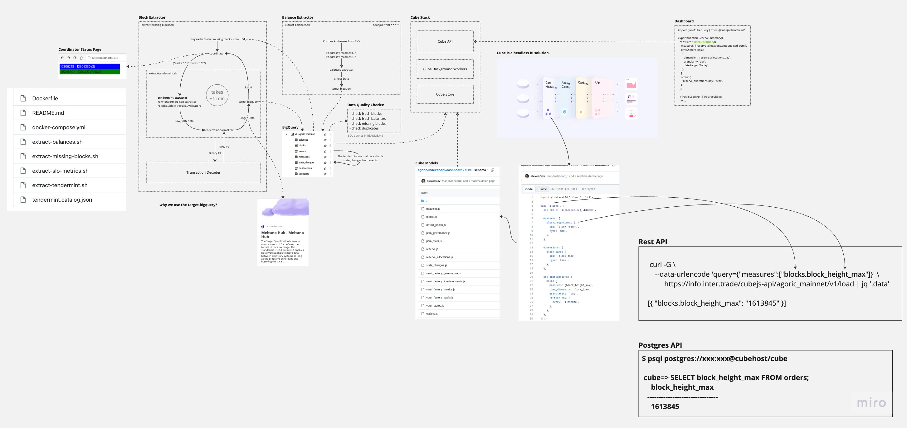

The solution consists of three main parts:

 - A block & balance extractors.
 - A Cube API.
 - And a dashboard.

# Extractors

The extractors have a modular architecture and each module can be used and tested separately.

`extract-missing-blocks.sh` is an entry point for the block extractor. It starts by querying existing block height ranges from BigQuery, retrieves a node state, calculates missing ranges, and pushes them to `extract-tendermint.sh`, is a sub-module entry point.

`extract-tendermint.sh` extracts raw JSON from the RPC node, from /block, /block_results, /validators endpoints, passes this data to the tendermint-normalizer, which makes more friendly rows for database tables, decodes binary transactions, and extracts state changes from state change events.

After that, `target-bigquery` writes these rows to BigQuery via the write API. The Bigquery has various methods to write data, but Google recommends using a write API, is a lastest version of their API, and we using it.

If everything goes well, the indexing loop repeats and it takes about one minute. You can track progress on a small status page.

`target-bigquery` is an external component from a singer.io ecosystem and can it be replaced with others targets for others databases.

Next is a simpler extractor for balances. It retrieves a static Cosmos address list, queries balances via GRPC, and writes them using the same method. We use balance data to show the interchain IST amount. 

# Big Query

After starting, we have seven tables that are checked every hour by several SQL queries to ensure everything is correct. You can find these queries in the README.md.

# Cube

The next significant part is Cube, an open-source tool for headless BI solutions.
For us, it allows describe data models and obtain an API with smart caching.

In the example, you can see a simple block model, where I describe a data source table, describe metrics like the latest block height, dimensions like block time, and cache settings that describe a pre-aggregation with those metrics and must updated every minute.

Cube provides a REST API, a GraphQL API, and even emulate a PostgreSQL database, it's allowing you to connect to the API via basic PostgreSQL drivers from any tools like Apache Superset or Jupyter Notebooks or etc.

Here you see a REST query example. I request block metrics using special query languages. You simply explain what you need and get it. Other examples of queries can be found in the repo, in an old API adapter or the dashboard, or you can build your queries in the Cube Playground in development mode.

The REST API can also send updates to the frontend via websockets. There's a demo page with this feature, and we can check the indexer and build cache speed. On this page you see a card with the latest height and a timer that resets after updates. As mentioned earlier, it takes about a minute. This feature is not used on other pages, but it's interesting.

# Dashboard

The last part is the dashboard, a simple single-page application built with React and the Cube client library. With this library, you have easy-to-use hooks for querying data through JSON requests.

# Perfomance testing

And I've done with the architecture, and finally, I ran load testing using a SaaS service called `flood.io`. The Cube API is a stateless service and can be scaled to any size. Currently, there are two replicas with 1 core and 2GB of memory. The results show that the service can handle requests from 500 users and processing almost 2000 requests per minute.

In the repository, you can find an another perfomance test in a "perf" directory. It uses a `vegeta` command line tool. Instructions on how to repeat the testing and attack the API with 50 workers are available. With this test, the API handles 4500 requests per minute with a small number of errors. This is the limit with the current setup.

Okay, I've finished. Do you have any questions?
