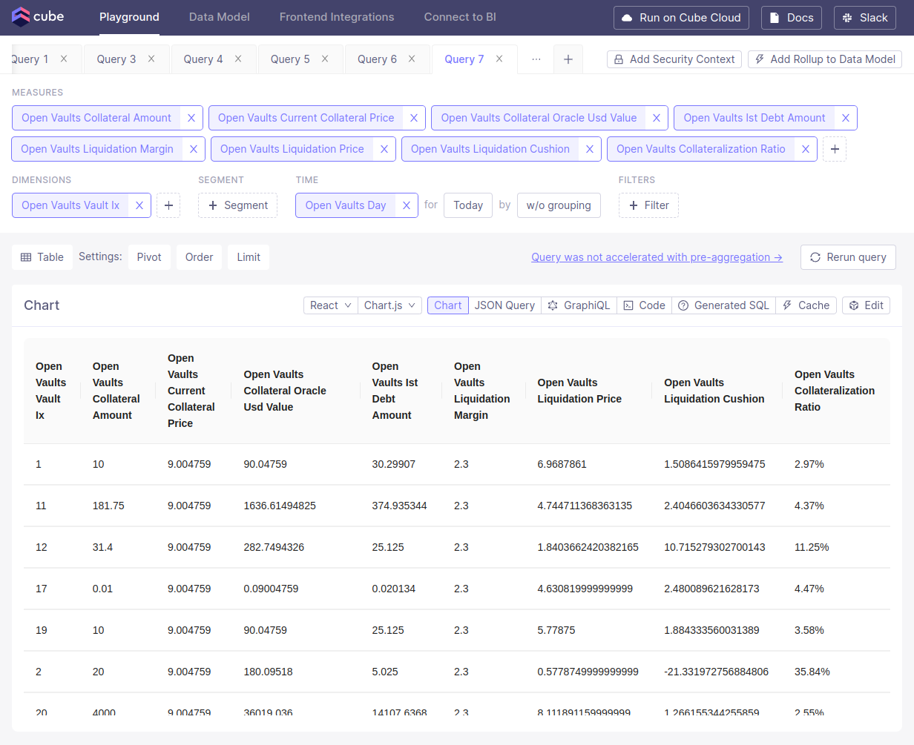

# Requests

The primary endpoint for handling requests is /cubejs-api/v1/load.
For further details, refer to the Cube documentation: [Cube Docs](https://cube.dev/docs/reference/rest-api).

Example request:

```bash
# Request with http method GET
curl \
  -G \
  --data-urlencode
  'query={"measures":["ibc_balances.amount_sum"],"timeDimensions":[{"dimension": "ibc_balances.day","dateRange": "Today"}]}' \
  http://localhost:4000/cubejs-api/v1/load

# Request with http method POST
# Use POST to fix problem with query length limits
curl \
 -X POST  \
 -H "Content-Type: application/json" \
 --data '{"query": {"measures":["ibc_balances.amount_sum"],"timeDimensions":[{"dimension": "ibc_balances.day","dateRange": "Today"}]}}' \
 http://localhost:4000/cubejs-api/v1/load
```

Example response:

```json
{
  "query": {
    "measures": [
      "ibc_balances.amount_sum"
    ],
    "timeDimensions": [
      {
        "dimension": "ibc_balances.day",
        "dateRange": [
          "2023-07-31T00:00:00.000",
          "2023-07-31T23:59:59.999"
        ]
      }
    ],
    "limit": 10000,
    "timezone": "UTC",
    "order": [],
    "filters": [],
    "dimensions": [],
    "rowLimit": 10000
  },
  "data": [
    {
      "ibc_balances.amount_sum": "793702.001897"
    }
  ],
  "lastRefreshTime": "2023-07-31T11:04:00.000Z",
  "usedPreAggregations": {
    "dev_pre_aggregations.ibc_balances_main": {
      "targetTableName": "dev_pre_aggregations.ibc_balances_main_tz3z0wdm_fkktrsu3_1icf590",
      "refreshKeyValues": [],
      "lastUpdatedAt": 1690801440000
    }
  },
  "transformedQuery": {
    "sortedDimensions": [],
    "sortedTimeDimensions": [
      [
        "ibc_balances.day",
        "day"
      ]
    ],
    "timeDimensions": [
      [
        "ibc_balances.day",
        null
      ]
    ],
    "measures": [
      "ibc_balances.amount_sum"
    ],
    "leafMeasureAdditive": true,
    "leafMeasures": [
      "ibc_balances.amount_sum"
    ],
    "measureToLeafMeasures": {
      "ibc_balances.amount_sum": [
        {
          "measure": "ibc_balances.amount_sum",
          "additive": true,
          "type": "sum"
        }
      ]
    },
    "hasNoTimeDimensionsWithoutGranularity": false,
    "allFiltersWithinSelectedDimensions": true,
    "isAdditive": true,
    "granularityHierarchies": {
      "year": [
        "year",
        "quarter",
        "month",
        "month",
        "day",
        "hour",
        "minute",
        "second"
      ],
      "quarter": [
        "quarter",
        "month",
        "day",
        "hour",
        "minute",
        "second"
      ],
      "month": [
        "month",
        "day",
        "hour",
        "minute",
        "second"
      ],
      "week": [
        "week",
        "day",
        "hour",
        "minute",
        "second"
      ],
      "day": [
        "day",
        "hour",
        "minute",
        "second"
      ],
      "hour": [
        "hour",
        "minute",
        "second"
      ],
      "minute": [
        "minute",
        "second"
      ],
      "second": [
        "second"
      ]
    },
    "hasMultipliedMeasures": false,
    "hasCumulativeMeasures": false,
    "windowGranularity": null,
    "filterDimensionsSingleValueEqual": {},
    "ownedDimensions": [],
    "ownedTimeDimensionsWithRollupGranularity": [
      [
        "ibc_balances.day",
        "day"
      ]
    ],
    "ownedTimeDimensionsAsIs": [
      [
        "ibc_balances.day",
        null
      ]
    ]
  },
  "requestId": "2d56862f-9857-443e-ae7c-d03ef5b9aae9-span-1",
  "annotation": {
    "measures": {
      "ibc_balances.amount_sum": {
        "title": "Ibc Balances Amount Sum",
        "shortTitle": "Amount Sum",
        "type": "number",
        "drillMembers": [],
        "drillMembersGrouped": {
          "measures": [],
          "dimensions": []
        }
      }
    },
    "dimensions": {},
    "segments": {},
    "timeDimensions": {}
  },
  "dataSource": "default",
  "dbType": "bigquery",
  "extDbType": "cubestore",
  "external": true,
  "slowQuery": false,
  "total": null
}
```

The following queries serve as examples for the dashboard:

## PSM Stats

```json
{
  "order": {
    "psm_governance.last_mint_limit": "desc"
  },
  "measures": [
    "psm_governance.last_mint_limit",
    "psm_stats.last_minted_pool_balance",
    "psm_stats.last_utilization_rate"
  ],
  "dimensions": [
    "psm_stats.coin"
  ],
  "timeDimensions": [
    {
      "dimension": "psm_stats.day",
      "granularity": "day",
      "dateRange": "Today"
    }
  ]
}
```

## Reserve

```json
{
  "measures": [
    "reserve.atom_amount_avg",
    "reserve.fee_amount_avg"
  ],
  "timeDimensions": [
    {
      "dimension": "reserve.day",
      "granularity": "day",
      "dateRange": "Today"
    }
  ]
}
```

## Vault managers

```json
{
  "measures": [
    "vault_managers.total_locked_collateral",
    "vault_managers.total_locked_collateral_usd",
    "vault_managers.total_ist_minted",
    "vault_managers.colletarization_ratio",
    "vault_managers.ist_minting_limit",
    "vault_managers.utilization_rate"
  ],
  "timeDimensions": [
    {
      "dimension": "vault_managers.day",
      "granularity": "day",
      "dateRange": "Today"
    }
  ],
  "order": {
    "vault_managers.total_locked_collateral": "desc"
  },
  "dimensions": [
    "vault_managers.type"
  ]
}
```

### Open Vaults

```json
{
  "measures": [
    "open_vaults.collateral_amount",
    "open_vaults.current_collateral_price",
    "open_vaults.collateral_oracle_usd_value",
    "open_vaults.ist_debt_amount",
    "open_vaults.liquidation_margin",
    "open_vaults.liquidation_price",
    "open_vaults.liquidation_cushion",
    "open_vaults.collateralization_ratio"
  ],
  "timeDimensions": [
    {
      "dimension": "open_vaults.day",
      "dateRange": "Today"
    }
  ],
  "dimensions": [
    "open_vaults.vault_ix"
  ],
  "order": [
    [
      "open_vaults.vault_ix",
      "asc"
    ]
  ]
}
```

### Total Interchain IST

```json
{
  "order": {},
  "measures": [
    "ibc_balances.amount_sum"
  ],
  "timeDimensions": [
    {
      "dimension": "ibc_balances.day",
      "dateRange": "Today"
    }
  ]
}
```

### Cube Playground

You can test and make your own queries in the [Cube Playground](https://cube.dev/docs/product/workspace/playground):


